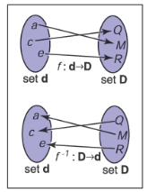
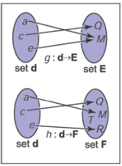
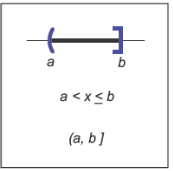
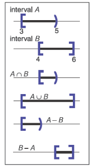

# 2 数学杂项
## 2.1 集合与映射
映射，也称为函数，是数学和编程中的基础概念。就像程序中的函数一样，数学中的映射接受一个特定`类型`的参数，并将其映射（返回）到一个特定类型的对象。在程序中我们称之为“类型”，在数学中我们则看作“集合”。当我们有一个属于某个集合的对象时，我们使用 ∈ 符号。例如，
${ a \in S }$

可以读作“a 是集合 S 的一个成员”。对于任意两个集合 A 和 B，我们可以通过取它们的笛卡尔积来创建第三个集合，记作 A × B。这个集合 A × B 由所有可能的有序对 (a, b) 组成，其中 a ∈ A 和 b ∈ B。作为简写，我们使用符号 A^2 来表示 A × A。我们可以将笛卡尔积扩展到三个集合的所有可能有序三元组，以及任意多个集合的任意长有序元组。

一些常见的集合包括：
- ${ \mathbb{R} }$ — 实数集；
- ${ \mathbb{R}^+ }$ — 非负实数集（包括零）；
- ${ \mathbb{R}^2 }$ — 所有二维平面上的有序对；
- ${ \mathbb{R}^n }$ — n 维笛卡尔空间；
- ${ \mathbb{Z} }$ — 整数集；
- ${ S^2 }$ — 单位球面上的三维点（即 ${ \mathbb{R}^3 }$ 中的点）。

注意，尽管 ${ S^2 }$ 是由嵌入三维空间中的点组成的，但它位于一个可以用两个变量参数化的表面上，因此可以被视为一个二维集合。映射的符号使用箭头和冒号，例如，

${ f : \mathbb{R} \rightarrow \mathbb{Z}, }$

读作：“函数 f，接受一个实数作为输入，并将其映射到一个整数上。”此处，箭头前面的集合被称为函数的定义域（domain），箭头右侧的集合被称为目标集（target）。对于计算机程序员而言，以下等价的语言可能更为熟悉：“函数 f，接受一个实数参数并返回一个整数。”换句话说，上面的集合表示法等同于常见的编程表示法：
${ \text{integer } f(\text{real}) \text{ ← equivalent → } f : \mathbb{R} \rightarrow \mathbb{Z}. }$
因此，冒号-箭头符号可以被看作是一种编程语法。就是这么简单。

将点 ${ f(a) }$ 称为 ${ a }$ 的像（image），集合 ${ A }$ 的像（定义域的子集合）是目标集中集合 ${ A }$ 中所有点对应的像的子集。整个定义域的像被称为函数的值域（range）。

### 2.1.1
函数 ${f:A \rightarrow B}$ 的反函数 ${f^{-1} : B \rightarrow A}$，定义为当 ${b=f(a)}$时${a=f^{-1}(b)}$。该定义仅在对每一个${b \in B}$在函数 ${f}$ 的作用下是某个点的像（即目标集等于值域）且这种点仅有一个（即只有一个 a 对应 ${f(a)=b}$）。这种映射或函数称为双射（bijections）。一个双射将每一个 ${a \in A}$ 映射到唯一的 ${b \in B}$，并且对于每一个 ${b \in B}$ 正好存在一个 ${a \in A}$ 使得 ${f(a)=b}$ 成立。在骑手集合和马集合之间的双射表示每个骑手都有单独骑一匹马，并且每个马都有人骑。两个函数可以为 ${rider(horse)}$ 和 ${horse(rider)}$，它们互为反函数。非双射的函数没有反函数（图 2.2）。

> 图 2.1 双射 ${f}$ 及其反函数 ${f^{-1}}$，${f^{-1}}$ 也是一个双射。

> 图 2.2 映射 ${g}$ 不存在反函数，因为两个 d 中的元素映射到了相同的 E 中的元素。函数 ${f}$ 不存在反函数因为元素 T 在 集合 d 中没有可以映射的元素。

一个双射的例子：${\mathbb{R} \rightarrow ： \mathbb{R} f(x) = x^3}$。它的反函数为${f^{-1}(x)=\sqrt[3]{x}}$。该例表明标准的符号有时也很迷惑，因为变量 x 同时用作 ${f}$ 和 ${f^{-1}}$ 的虚拟变量。有时候使用不同的虚拟变量：${y=f(x)}$ 和 ${x=f^{-1}(y)}$ 会更易理解，例如 ${y=x^3}$ 和 ${x= \sqrt[3]{y}}$。一个没有反函数的例子就是开方：${\mathbb{R} \rightarrow \mathbb{R} : f(x) = x^2}$。有两个原因：首先 ${x^2=(-x)^2}$，其次定义域中没有对应的成员可以映射到目标集中的负数部分。注意如果我们限制定义域为 ${\mathbb{R}^+}$ 就可以定义反函数，此时 ${\sqrt{x}}$ 就是有效的反函数。

### 2.1.2 区间
我们经常需要规定一个函数处理被取值被限制的实数。我们将限制规定为区间（interval）。一个实数上的区间的例子就是 0 到 1 之间的所有实数且不包括 0 和 1，将其声明为 ${(0,1)}$。因为其不包含端点，可以称为开区间。另一种限制闭区间则包含端点，使用方括号声明 ${[0,1]}$。区间的声明可以混合，例如 ${[0,1)}$ 包含 0 但没有 1。写下区间 ${(a,b)}$ 时，我们假设 ${a \leq b}$。三种表示区间的通常方法在图 2.3 中展示。区间的笛卡尔积经常用到。例如，若指明点 ${x}$ 位于 3D 中的单位立方体中，使用 ${x \in [0,1]^3}$。

区间结合集合操作在合取（conjunction）中特别有用，例如：交集（intersection）、并集（union）、差集（difference）。例如，两段区间的交集就是他们公共点的集合。符号 ${\cap}$ 表示交集，例如：${[3,5) \cap [4,6]=[4,5)}$。并集使用符号 ${\cup}$，表示位于任意一个集合的所有点、例如：${[3,5) \cup [4,6]=[3,6]}$。不同与前两个操作，差集会根据参数次序产生不同的结果。负号用于表示差集操作，得到所有位于左侧区间但不位于右侧区间的所有点。例如，${[3,5) - [4,6]=[3,4)}$，${[4,6] - [3,5)=[5,6]}$。这些操作示意图见图 2.4。

> 图2.4 区间操作

### 2.1.3 对数
虽然在计算器出现之前，对数（logarithms）并不像以前那样普遍，但在涉及指数项的方程问题中，对数通常很有用。根据定义，每一个对数拥有一个底数 ${a}$，x 对底数 ${a}$ 的 log 写为 ${\log_{a}(x)}$ 并且定义为“使得 a 得到 x 的指数”：
${y=\log_{a}(x) \iff a^y = x}$

注意对数的底 ${a}$ 是和以 ${a}$ 为底数的指数方程互为反函数。这一定义有以下几项推论：

${a^{\log_{a}(x)=x}}$

${\log_{a}(a^x)=x}$

${\log_{a}(xy)=\log_{a}(x) + \log_{a}(y)}$

${\log_{a}(x/y)=\log_{a}(x) - \log_{a}(y)}$

${\log_{a}(x)=\log_{a}(b)\log_{b}(x)}$

进行对数运算时，有一个特殊数字 ${e=2.718...}$ 经常出现。以 ${e}$ 为底的对数称为自然对数，通常使用这个缩写表示：

${\ln x \equiv \log_{e} x}$

${\equiv}$ 表示“定义相等”。类似 ${\pi}$, 数字  ${e}$ 在各种情景中都有重要应用。许多领域使用 ${e}$ 以外的底数进行计算并给予了特别的符号，例如 ${\log x}$。例如，天文学通常使用数字 10 作为底数，理论计算机科学通常使用 2 作为底数。因为计算机图形学从诸多领域获得了技术，我们将会避开这些缩写。

对数和指数的导数可以展现为什么自然对数是”自然的“：

${\frac{d}{dx}\log_{a}x = \frac{1}{xlna}}$

${\frac{d}{dx}a^x = a^x lna}$

仅有当 ${a=e}$ 时，上面的系数是单位 1。
