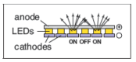
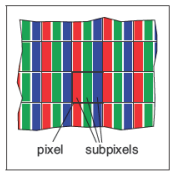
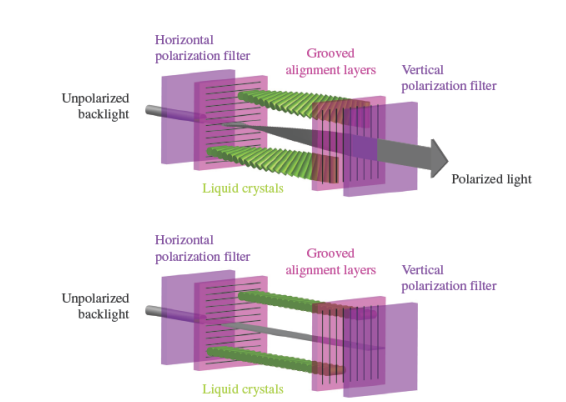
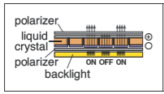
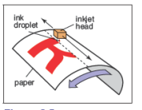
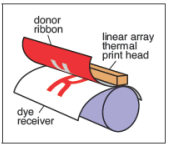
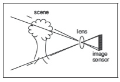
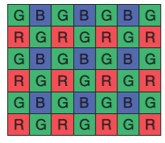
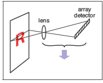

## 3.1 光栅设备
在对光栅图像进行抽象的讨论之前，浏览一下使用光栅图像的具体设备有助理解。几种熟悉的光栅设备依据简单的层次结构可分类为：

- 输出
  - 显示
    - 透射式：液晶显示器（LCD）
    - 自发光式：发光二极管显示器（LED）
  - 硬拷贝
    - 二进制：喷墨打印机
    - 连续色调：染料升华打印机
- 输入
  - 2D 数组传感器：数码相机
  - 1D 数组传感器：平板扫描仪

这些设备的基本操作和分类有助于理解光栅图像的具体应用和功能。

### 3.1.1 显示器
当前的显示器几乎普遍基于固定的像素阵列，包括电视、数字电影投影仪、计算机显示器以及投影仪等。它们可以分为发光显示和透射显示两种类型。发光显示使用能够直接发射可控光量的像素，而透射显示中像素本身不发光，而是调节穿过它们的光量。透射显示需要光源显示像素：在像素阵列后有一个背光。如投影仪则使用灯泡发出光线，通过像素阵列后投射到屏幕上。发光显示每个像素本身就是光源。

发光二极管（LED）显示正是发光类型的一个例子。每个像素通常由一个或多个LED组成，这些半导体器件根据通过它们的电流强度发光（见图3.1）。

> 图 3.1 发光二极管的显示操作

彩色显示器中的像素分为三个独立控制的亚像素：红色、绿色和蓝色，每个亚像素使用不同材料制成的 LED 发出不同颜色的光（图3.2）。当从一定距离观看显示时，人眼无法分辨出单个亚像素，所感知的颜色是红、绿、蓝的混合。

> 图 3.2 红绿蓝亚像素在平面显示器的一个像素中

液晶显示器（LCD）属于透射类型的一种。液晶是一种能够旋转通过它的光的偏振方向的材料，其分子结构能够根据施加的电场调节旋转的程度。每个 LCD 像素（图3.3）背后有一层偏光膜，它可以由偏振光照射显示，通常假设为水平偏振光。

> 图 3.3 LCD 显示屏上的一个像素处于关闭状态（底部图像），前偏光片挡住了所有从通过后偏光片的光。处于开启状态时（顶部图像），液晶单元旋转光的偏振方向，使得光通过前偏光片。图由 Reinhard、Khan、Akydz和Johnson（2008）提供。

> 图 3.4 液晶显示器的操作

对于显示器和图像来说，分辨率仅指像素网格的维度：如果一台桌面显示器的分辨率为1920 x 1200像素，这意味着它有 2,304,000 个像素排列成 1920 列和 1200 行。不同分辨率的图像要填满屏幕，必须使用第 10 章的方法将其转换为1920 x 1200的图像。

> 显示屏的分辨率有时称为原生分辨率（native resolution），因为大部分显示屏可以通过内置转换处理其他解析度的图像，

### 3.1.2 硬拷贝设备
将图像永久记录在纸上的过程与在显示器上暂时显示图像的有着完全不同的限制。在打印中，颜料分布在纸张或其他介质上，当光反射到纸上时，就会形成所需的图像。打印机和显示器一样是光栅设备，但许多打印机只能打印二值图像——颜料要么在每个网格位置沉积，要么不沉积，不可能有中间状态。

喷墨打印机（图 3.5）就是一个通过扫描形成光栅图像的设备的例子。喷墨打印头包含携带颜料的液体墨水，可以在电子控制下喷出非常小的墨滴。打印头在纸上移动，当它经过需要上墨的网格位置时喷出墨滴；在打算保持空白的区域则不喷墨。每次扫过后，纸张会略微前进，然后下一行网格会被打印下来。彩色打印是通过使用多个打印头来实现的，每个打印头喷出的墨水带有不同的颜料，这样每个网格位置可以接收到不同颜色墨滴的任意组合。由于所有墨滴都是相同的，喷墨打印机打印的是二值图像：在每个网格点上，要么有墨滴，要么没有墨滴；不存在中间的色调。

> 图 3.5 喷墨打印机的操作

喷墨打印机没有物理的像素阵列；分辨率取决于墨滴可以做得多小以及每次扫过后纸张推进的距离。许多喷墨打印机的打印头中有多个喷嘴，可以在一次打印过程中完成多次扫过，但最终决定行间距的是纸张的推进，而不是喷嘴的间距。

> 也存在连续喷墨打印机，它们在包裹在旋转鼓上的纸上沿着连续的螺旋路径打印，而不是来回移动打印头。

热染料转移过程是连续色调打印过程的一个例子，即每个像素处可以沉积不同量的染料——不像喷墨打印机那样是全有或全无的（图 3.6）。包含彩色染料的供体带（donor ribbon）被压在纸张（或染料接收器）和包含线性加热元件阵列的打印头之间，打印头中的每个加热元件对应图像中的每一列像素。当纸张和供体带经过打印头时，加热元件根据需要染料的区域来启动或关闭加热供体带，从而使染料从带子扩散到纸张上。这个过程对每种染料颜色重复进行。由于较高的温度会导致更多的染料被转移，可以控制每个网格位置上每种染料的沉积量，从而生成连续范围的颜色。打印头中加热元件的数量确定了页面横向的固定分辨率，但纵向分辨率由加热和冷却的速率相对于纸张移动的速度决定。

与显示器不同，打印机的分辨率是通过像素密度而不是像素总数来描述的。因此，如果热升华打印机在其打印头上每英寸有300个间隔的元件，则其横向分辨率为每英寸300像素（ppi）。如果纵向分辨率选择相同，我们可以简单地说打印机的分辨率为300 ppi。一台喷墨打印机在一个每英寸1200个网格点的网格上放置墨点，则描述为其分辨率为每英寸1200点（dpi）。由于喷墨打印机是一个二进制设备，因此它需要一个更细的网格，至少有两个原因。因为边缘是突然的黑/白边界，为了避免出现台阶效应或混叠现象（见第 9.3 节），需要非常高的分辨率。当打印连续色调图像时，需要高分辨率来通过打印称为半色调的不同密度点模式来模拟中间颜色。

> 术语 `dpi` （每英寸点数） 也经常用于表示每英寸像素数（pixels per inch, ppi），但是 dpi 应该用于二进制设备，而 ppi 用于连续色调设备。

### 3.1.3 输入设备

光栅图像必须有其来源，所有不通过算法计算出的图像都必须通过某种光栅输入设备测量得出，最常见的是相机和扫描仪。即使在渲染3D场景图像时，照片也常常作为纹理贴图使用（见第 11 章）。光栅输入设备必须对每个像素进行光度测量，并通常基于传感器阵列（与输出设备一样）。

数码相机是 2D 阵列输入设备的一个例子。相机中的图像传感器是一种具有光敏像素网格的半导体器件。两种常见的阵列类型被称为 CCD（电荷耦合器件）和 CMOS（互补金属氧化物半导体）图像传感器。相机的镜头将拍摄场景的图像投射到传感器上，然后每个像素测量落在其上的光能量，最终生成一个数值输入到输出图像（图 3.7）。与彩色显示器使用红、绿、蓝子像素的方式相同，大多数彩色相机通过使用**色彩滤光阵列**（color-filter array）或**马赛克**（mosaic）工作，允许每个像素只留下红色、绿色或蓝色光，由图像处理软件填充缺失值，这个过程被称为**去马赛克处理**（图3.8）。

> 图 3.7 数码相机的操作

> 图 3.8 大多数彩色相机使用如上所示的类似拜耳-马赛克的色彩滤光阵列。每一个像素测量红、蓝、绿光。

其他相机使用三个独立的阵列或阵列中独立的三层来测量每个像素的独立的红色、绿色和蓝色值，从而在不进行进一步处理的情况下生成可用的彩色图像。相机的分辨率由阵列中的固定像素数量决定，通常用总像素数来表示：一个具有 3000 列和 2000 行阵列的相机生成分辨率为 3000×2000 的图像，拥有 600 万像素，被称为 6 MP 相机。重点注意，马赛克传感器并不测量完整的彩色图像，因此一个测量相同数量像素但具有独立红色、绿色和蓝色测量的相机会比一个使用马赛克传感器的相机记录更多关于图像的信息。

> 相机销售商使用 m 表示 10 的 6 次方大小而不是像 mb 一样的 2 的 20 次方大小。

平板扫描仪也测量每个像素的红色、绿色和蓝色值，不过类似热染料转移打印机，它使用 1D 阵列扫过被扫描的页面，每秒进行多次测量（图3.9）。页面横向的分辨率由阵列的大小决定，纵向的分辨率由与扫描头移动速度相比的测量频率决定。彩色扫描仪具有 $ 3 × n_x$ 阵列，其中 $n_x$ 是页面上像素的数量，三个行覆盖红色、绿色和蓝色滤光片。通过适当延迟三个颜色的测量时间，可以在每个网格点进行三次独立的颜色测量。与连续色调打印机一样，扫描仪的分辨率以每英寸像素数（ppi）表示。

> 扫描仪的分辨率有时也被称为`光学分辨率`（optical resolution），因为大部分扫描仪可以使用内置的转换产生其他分别率的图像。

了解了图像从哪来、到哪去，我们现在在更抽象的层次上讨论图像，并且可以使用图形算法。